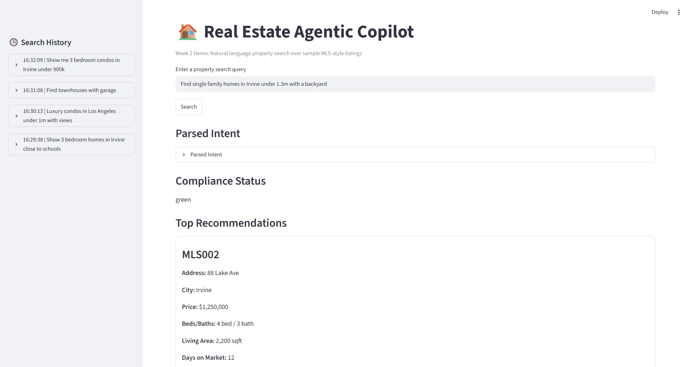

# IDX Exchange Agentic AI Project

## Overview

This repository contains my individual project work for the IDX Exchange Summer 2026 internship.

The project explores an Agentic AI workflow for natural language property search. Users can describe property requirements in natural language, and the system converts the request into a structured search intent, retrieves matching MLS-style listings, ranks the results, and generates explanations for each recommendation.

The project now supports both a lightweight CSV dataset for local development and a MySQL-backed MLS search layer using parameterized SQL. The repository architecture allows different search backends to be swapped without changing the agent workflow. This modular design makes it straightforward to extend the project to additional data sources or production MLS services in the future. 

---

## Current Features

### Natural Language Property Search

The system accepts natural language property search requests and converts them into a structured property intent.

The current parser extracts:

- City
- Budget
- Bedrooms
- Bathrooms
- Property type
- Preference keywords

Example:

```text
Find single family homes in Irvine under 1.3m with a backyard

↓

PropertyIntent

{
    city: Irvine
    max_price: 1300000
    property_type: Single Family Residence
    keywords: ["backyard"]
}
```

---

### Structured Property Search

The extracted property intent is used to retrieve matching MLS-style listings.

The search pipeline combines:

- Structured filtering
  - City
  - Budget
  - Bedrooms
  - Bathrooms
  - Property type

- Keyword matching
  - Search over listing descriptions (`public_remarks`)

The current project supports both a lightweight CSV dataset for local development and a MySQL-backed MLS database for production-oriented property search. The search layer is designed to be replaced by a production database without changing the agent workflow.

---

### MySQL-backed Search Layer

The search module now supports a production-oriented MySQL backend in addition to the original CSV repository. 

The Query Builder generates parameterized SQL, while the formatter converts raw MLS records into typed ListingSchema objects. 

The search pipeline is organized using a Repository Pattern:

```
PropertyIntent
        │
        ▼
PropertyQueryBuilder
        │
        ▼
SearchRepository
   ├── CSVSearchRepository
   └── MySQLSearchRepository
        │
        ▼
PropertyFormatter
        │
        ▼
ListingSchema
```


Key design features include:

- Parameterized SQL queries
- SQL injection protection
- Query Builder abstraction
- Repository Pattern
- Listing formatter for MLS records
- Pydantic-based typed data models

The same search interface can be reused with different data sources without changing the agent workflow.

---

### Property Recommendation

Matching listings are ranked using a simple recommendation strategy based on:

- Days on market
- Listing price

Top recommendations are returned to the user.

---

### Explainable Recommendations

For each recommendation, the system generates a natural language explanation describing why the listing satisfies the user's request.

Example:

> Matched because it is in Irvine, under your budget, has at least 3 bedrooms, and the listing remarks mention "backyard".

---

### Interactive Streamlit Demo



A lightweight Streamlit interface demonstrates the complete workflow.

Features include:

- Natural language search
- Parsed intent visualization
- Property recommendations
- Generated explanations
- Session-based search history

---

## Current Architecture

```
User Query
      │
      ▼
Intent Agent
      │
      ▼
PropertyIntent
      │
      ▼
PropertyQueryBuilder
      │
      ▼
SearchRepository
 ├── CSV
 └── MySQL
      │
      ▼
PropertyFormatter
      │
      ▼
Recommendation
      │
      ▼
Explanation
```

---

## Technology Stack

- Python 3.10
- MySQL
- mysql-connector-python
- Streamlit
- Pandas
- Pydantic
- Pytest

---

## Run the Demo

Install dependencies:

```bash
pip install -r requirements.txt
```

Run the Streamlit application:

```bash
python -m streamlit run src/app/streamlit_app.py
```

The application will be available locally at:

```
http://localhost:8501
```

---

## Unit Tests

The project includes unit tests covering the core search pipeline.

Current test coverage includes:

- Intent Agent
- SQL query generation
- CSV search repository
- MySQL search repository
- Listing formatter

Run all tests:

```bash
pytest
```

or

```bash
python -m pytest
```

---

## Example Queries

Additional sample queries are available in examples/sample_queries.md.

These examples demonstrate the supported natural language search capabilities of the current prototype.

---

## Project Status

Current progress includes:

- Natural language intent parsing
- MySQL-backed property search
- Repository Pattern
- Parameterized SQL query generation
- Keyword-based property search
- Property recommendation
- Explainable recommendations
- Interactive Streamlit demo
- Session search history
- Unit testing with pytest