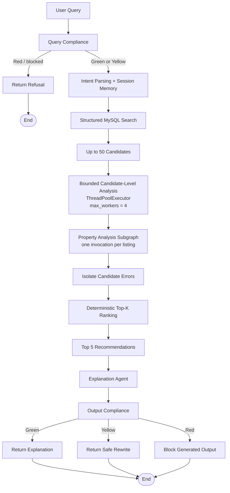

# IDX Exchange Agentic AI Project

## Overview

A LangGraph-based conversational real-estate search and recommendation system with structured MLS retrieval, session memory, Fair Housing guardrails, market-aware ranking, and bounded parallel property analysis.

> This repository contains my individual project work for the IDX Exchange Summer 2026 internship. Internal MLS data is not included.

## Key Engineering Highlights

- LangGraph orchestration with conditional query blocking and output screening
- Natural-language intent parsing with hard constraints and soft preferences
- Multi-turn session memory for progressive property-search refinement
- Parameterized MySQL search over active listings and recent sold comparables
- Reusable listing-level `PropertyAnalysisSubgraph`
- Hierarchical parallel analysis with bounded four-worker candidate concurrency
- Deterministic Top-K ranking with a stable listing-key tie-breaker
- Typed, validated, immutable recommendation scoring configuration
- Candidate-level failure isolation and structured error reporting
- 111 passing automated tests plus MySQL-backed smoke and performance validation

## Week 6 Results

Week 6 focused on converting the existing recommendation workflow into a more reusable, measurable, and production-style architecture.

| Area | Result |
|---|---|
| Candidate pool | Up to 50 listings |
| Parallel execution | Maximum 4 candidate analyses concurrently |
| Sequential median latency | 50.60 s |
| Parallel median latency | 22.92 s |
| Speedup | 2.21× |
| Median latency reduction | 54.7% |
| Successful candidate analyses | 50 / 50 |
| Candidate errors | 0 |
| Sequential/parallel output consistency | PASS |
| Automated tests | 111 passed |

The latency benchmark measures the **candidate property-analysis stage**, not the full Streamlit request lifecycle. Both execution modes used the same parsed intent and the same 50 candidate objects. Three alternating sequential/parallel pairs were measured, and Top-5 recommendation outputs were checked after every pair.

Raw benchmark results are available in:

```text
artifacts/benchmarks/candidate_parallel_baseline.csv
```

## Architecture


```mermaid
flowchart TD
    U[User Query] --> QC[Query Compliance]

    QC -->|Red / blocked| REFUSAL[Return Refusal]
    REFUSAL --> END1([End])

    QC -->|Green or Yellow| INTENT[Intent Parsing + Session Memory]
    INTENT --> SEARCH[Structured MySQL Search]
    SEARCH --> CANDIDATES[Up to 50 Candidates]

    CANDIDATES --> PARALLEL[Bounded Candidate-Level Analysis<br/>ThreadPoolExecutor<br/>max_workers = 4]
    PARALLEL --> SUBGRAPH[Property Analysis Subgraph<br/>one invocation per listing]
    SUBGRAPH --> ERRORS[Isolate Candidate Errors]
    ERRORS --> RANK[Deterministic Top-K Ranking]

    RANK --> TOP5[Top 5 Recommendations]
    TOP5 --> EXPLAIN[Explanation Agent]
    EXPLAIN --> OC[Output Compliance]

    OC -->|Green| RESPONSE[Return Explanation]
    OC -->|Yellow| REWRITE[Return Safe Rewrite]
    OC -->|Red| BLOCK[Block Generated Output]

    RESPONSE --> END2([End])
    REWRITE --> END2
    BLOCK --> END2
```

Each listing is analyzed through a reusable LangGraph subgraph:


```mermaid
flowchart TD
    START([Listing + PropertyIntent])

    START --> MARKET[Market Context]
    START --> PREF[Soft Preference Match]

    MARKET --> VALUE[Comparable Value]
    MARKET --> NEG[Negotiation Analysis]

    PREF --> FANIN[Fan-In]
    VALUE --> FANIN
    NEG --> FANIN

    FANIN --> SCORE[Configurable Recommendation Scoring]
    CONFIG[RecommendationConfig] --> SCORE
    SCORE --> OUTPUT[RecommendationScore]
```

The system therefore uses two levels of parallelism:

1. Up to four listing-level subgraphs run concurrently.
2. Inside each subgraph, Market Context and Preference Match run independently, followed by parallel Comparable Value and Negotiation analysis.

For detailed workflow boundaries, concurrency design, failure handling, state contracts, and limitations, see [`docs/architecture.md`](docs/architecture.md).

## Core Workflow

### 1. Natural-Language Intent Parsing

The `IntentAgent` converts conversational requests into a structured `PropertyIntent`.

Supported fields include:

- City
- Maximum budget
- Minimum bedrooms
- Minimum bathrooms
- Property type
- Hard search keywords
- Soft user preferences

Example:

```text
Find townhouses in Irvine under 1.2 million
with a garage, preferably with a pool and a view.

↓

PropertyIntent
{
    city: Irvine
    max_price: 1200000
    property_type: Townhouse
    keywords: ["garage"]
    preferences: ["pool", "view"]
}
```

Hard constraints determine candidate eligibility. Soft preferences remain outside SQL filtering and influence downstream ranking instead.

### 2. Multi-Turn Session Memory

`SessionMemory` allows incomplete follow-up queries to inherit prior search criteria.

```text
Turn 1: Find townhouses in Irvine
Turn 2: Under 1.2 million
Turn 3: At least 3 bedrooms with a garage, preferably with a pool
```

The resulting intent retains city, property type, budget, bedroom count, hard keywords, and soft preferences. Blocked compliance requests do not modify memory.

### 3. Query and Output Compliance

The workflow applies rule-based Fair Housing safeguards at two boundaries:

```text
User Query → Query Compliance → Workflow → Output Compliance → Final Response
```

| Risk level | Behavior |
|---|---|
| Green | Continue normally |
| Yellow | Continue using neutral, objective language |
| Red | Block before downstream workflow execution |

Current coverage includes protected-class requests, familial-status exclusions, religion, national origin, sex or gender restrictions, disability-related exclusion, subjective safety language, school proxies, and demographic steering.

The guardrail distinguishes exclusionary language from legitimate accessibility requests.

### 4. Structured MySQL Property Search

The active-listing search path follows the Repository Pattern:

```text
PropertyIntent
    ↓
PropertyQueryBuilder
    ↓
SearchRepository
    ├── CSVSearchRepository
    └── MySQLSearchRepository
    ↓
PropertyFormatter
    ↓
ListingSchema
```

The MySQL implementation uses parameterized SQL and converts raw rows into typed Pydantic objects. Current hard filtering supports city, price, bedrooms, bathrooms, property type, and required listing-remark keywords.

### 5. Property Analysis Subgraph

Each candidate listing is analyzed by a dedicated `PropertyAnalysisSubgraph`.

The subgraph produces three recommendation signals:

| Signal | Responsibility |
|---|---|
| Preference Match | Measures alignment with optional user preferences |
| Comparable Value | Evaluates asking value relative to recent similar sales |
| Negotiation | Estimates buyer leverage from comparable-market signals |

The subgraph returns one structured `RecommendationScore`; collection-level ranking remains the responsibility of the parent graph.

### 6. Market and Comparable Retrieval

`MarketAgent` uses recent sold records from `california_sold` to produce city-level and listing-specific market context.

Comparable retrieval first searches for recent sold properties within a recent-sale window using strict similarity criteria. When insufficient comparable sales are available, the search progressively relaxes matching constraints before falling back to broader market-level comparables: 

```text
strict → relaxed → broad → market_fallback
```

Matching may consider:

- City and postal code
- Property subtype
- Bedroom and bathroom ranges
- Living-area tolerance
- Recent sale window

This preserves evidence coverage when strict comparables are sparse.

### 7. Configurable Recommendation Scoring

The default recommendation policy combines three normalized scores:

| Component | Default weight |
|---|---:|
| Preference Match | 40% |
| Comparable Value | 35% |
| Negotiation | 25% |

```text
Overall Score =
    Preference Match × 0.40
  + Comparable Value × 0.35
  + Negotiation × 0.25
```

Weights and label thresholds are stored in an immutable `RecommendationConfig`. Validation ensures that weights are non-negative, sum to 1.0, and that score thresholds remain ordered.

| Score | Label |
|---|---|
| 80–100 | Strong Match |
| 65–79.99 | Good Match |
| 50–64.99 | Moderate Match |
| Below 50 | Limited Match |

The scoring policy can be replaced through dependency injection without changing the subgraph or parent workflow.

### 8. Deterministic Top-K Ranking

Parallel tasks complete in nondeterministic order, so completion order is never treated as recommendation order.

Final ranking uses:

```text
1. Overall score descending
2. Listing key ascending as a deterministic tie-breaker
```

This preserves stable Top-5 results across sequential and parallel execution.

### 9. Explainable Recommendations

Each final recommendation retains:

- Overall recommendation score
- Recommendation label
- Preference-match score
- Comparable-value score
- Negotiation score
- Supporting reason signals

The explanation layer consumes ranked `RecommendationScore` objects and is screened by output compliance before reaching the user.

## Parallel Execution and Failure Isolation

The parent workflow supports both execution modes:

```text
Sequential mode
Candidate 1 → Candidate 2 → ... → Candidate 50

Parallel mode
Up to 4 candidate subgraphs execute concurrently
```

A candidate failure is recorded as:

```text
{
    listing_key: ...,
    error: ...
}
```

Successful candidates continue to final ranking. A single malformed listing or repository error therefore does not automatically discard the entire batch.

## Performance Validation

The performance harness:

- parses and searches once;
- reuses the same 50 candidate objects in both modes;
- performs an unmeasured warm-up;
- runs three alternating sequential/parallel pairs;
- records successful and failed candidate counts;
- verifies Top-5 output consistency after every pair;
- reports median latency rather than a single run.

Measured runs:

```text
Sequential: 52.13 s, 50.60 s, 50.59 s
Parallel:   23.12 s, 22.92 s, 22.36 s
```

Result:

```text
50.60 s → 22.92 s
54.7% lower median candidate-analysis latency
2.21× speedup
0 candidate errors
Identical sequential/parallel recommendation outputs
```

The measured improvement reflects the combined effect of bounded candidate-level concurrency and parallel branches within the listing-level subgraph. The benchmark does not attempt to attribute the speedup to each layer independently.

## Interactive Streamlit Application

The Streamlit interface supports:

- Natural-language property search
- Multi-turn session memory
- Structured intent and memory inspection
- MySQL-backed candidate retrieval
- Market-aware recommendation scoring
- Explainable Top-5 recommendations
- Query and output compliance feedback
- Session history
- Start New Search

The workflow object is stored in the Streamlit session so conversational criteria persist across turns.

The full workflow currently depends on internal IDX Exchange MLS datasets that cannot be redistributed.

A public demonstration can be supported by replacing the current repositories with synthetic active-listing and sold-comparable datasets while preserving the existing workflow architecture.

Because the workflow depends on repository interfaces rather than specific data sources, the same application can operate on internal MLS data during development and synthetic datasets for public demonstrations without changing the higher-level workflow.

## Technology Stack

| Category | Technology |
|---|---|
| Language | Python 3.10 |
| Workflow orchestration | LangGraph |
| LLM framework | LangChain |
| Data validation | Pydantic |
| Database | MySQL |
| Frontend | Streamlit |
| Concurrency | `ThreadPoolExecutor` |
| Testing | Pytest |
| Version control | Git and GitHub |

## Local Setup

### Install dependencies

```bash
python -m venv .venv
```

```bash
# Windows
.venv\Scripts\activate

# macOS / Linux
source .venv/bin/activate
```

```bash
pip install -r requirements.txt
```

### Configure environment variables

Create a local `.env` file from the provided template:

```bash
# Windows
copy .env.example .env

# macOS / Linux
cp .env.example .env
```

Required local configuration includes MySQL host, port, user, password, database, and any configured model-provider credentials. Secrets must not be committed.

### Run the application

```bash
python -m streamlit run src/app/streamlit_app.py
```

The application is normally available at:

```text
http://localhost:8501
```

## Testing and Validation

Run all tests:

```bash
pytest -v
```

Current result:

```text
111 passed in 76.31s
```

Run the fast suite without MySQL-backed integration tests:

```bash
pytest -m "not integration" -v
```

Run the sequential/parallel consistency regression:

```bash
pytest tests/test_candidate_parallel_consistency.py -v
```

Run the real MySQL-backed parallel smoke test:

```bash
python -m src.dev_test_candidate_parallel
```

Run the latency benchmark:

```bash
python -m src.dev_benchmark_candidate_parallel
```

Validation currently covers:

- Intent parsing and hard/soft preference separation
- Session-memory inheritance and reset behavior
- Fair Housing query and output rules
- Query-builder and repository behavior
- Property formatting and typed schemas
- Market, comparable-value, preference, and negotiation analysis
- Configurable recommendation weights and thresholds
- Recommendation labels, ranking, tie-breaking, and output schema
- Property-analysis subgraph fan-out/fan-in behavior
- Parent LangGraph routing and error handling
- Sequential/parallel candidate coverage and score consistency
- MySQL-backed smoke testing
- Multi-run latency benchmarking

## Repository Structure

```text
src/
├── agents/                  # Specialized workflow agents
├── app/                     # Streamlit application
├── compliance/              # Fair Housing rule definitions
├── config/                  # Application settings and recommendation configuration
├── memory/                  # Session memory
├── providers/               # LLM provider abstractions and implementations
├── recommendation/          # Recommendation scoring, ranking, and explanation
├── schemas/                 # Pydantic and TypedDict contracts
├── search/                  # Repository interfaces and MySQL/CSV adapters
├── workflow/                # Parent LangGraph and property subgraph
├── dev_test_candidate_parallel.py
└── dev_benchmark_candidate_parallel.py

tests/                       # Unit, regression, and integration tests
docs/
└── architecture.md          # Detailed architecture and design decisions
artifacts/
└── benchmarks/
    └── candidate_parallel_baseline.csv
examples/
└── sample_queries.md
```
Internal MLS datasets are intentionally excluded. Public demonstrations should use synthetic data.

## Current Implementation

| Status | Capability |
|---|---|
| Implemented | LangGraph parent workflow with conditional compliance routing |
| Implemented | Multi-turn memory-aware intent parsing |
| Implemented | MySQL active-listing and sold-comparable repositories |
| Implemented | Reusable parallel property-analysis subgraph |
| Implemented | Bounded candidate-level concurrency |
| Implemented | Configurable deterministic recommendation scoring |
| Implemented | Sequential/parallel consistency regression |
| Implemented | Multi-run candidate-analysis latency benchmark |

Future architectural evolution and planned extensions are documented in docs/architecture.md. 

## Project Status

Week 6 delivers a tested, production-style MVP centered on reusable LangGraph subgraphs, hierarchical parallel execution, deterministic recommendation behavior, configurable scoring policy, MySQL-backed retrieval and quantitative performance validation.
