# IDX Exchange Agentic AI Project

## Overview

A production-style LangGraph-based real-estate copilot that combines
structured MLS retrieval, full-corpus semantic search, hybrid
recommendation, document-aware knowledge RAG, session memory, Fair
Housing guardrails, sold-comparable market analysis, bounded parallel
property analysis, and a Week 9 unified multi-capability orchestrator
exposed through Streamlit and FastAPI.

The system supports four complementary user workflows:

1.  **Natural-language property search** --- converts conversational
    requirements into structured MLS retrieval and explainable
    market-aware recommendations.
2.  **Similar-home recommendation** --- combines structured property
    similarity with embedding-based semantic similarity, then validates
    recommended listings against recent sold comparables.
3.  **Knowledge Assistant** --- retrieves project-document evidence for
    real-estate concepts, MLS-field mappings, and handbook/reference
    questions, then generates a grounded answer from that context.
4.  **Unified Agentic Copilot** --- routes a natural-language request to
    property search, market analysis, similar-home recommendation,
    knowledge RAG, or a mixed multi-capability path. Mixed requests use
    LangGraph fan-out/fan-in execution and merge completed branch
    results into one response.

> This repository contains my individual project work for the IDX
> Exchange Summer 2026 internship. Internal MLS data is not included.

## Key Engineering Highlights

-   **LangGraph real-estate copilot** with natural-language intent
    parsing, Fair Housing guardrails, multi-turn search memory, and
    explainable Top-5 recommendations.
-   **Two-level parallel property analysis** with bounded candidate
    execution; benchmarked at **2.21× speedup** and **54.7% lower median
    candidate-analysis latency** while preserving deterministic Top-5
    output.
-   **MySQL-backed structured retrieval** over active listings and
    recent sold comparables, with market, comparable-value, negotiation,
    and preference signals.
-   **52,794-listing semantic retrieval stack** using OpenAI embeddings,
    FAISS, checkpoint/resume indexing, and hybrid hard-constraint +
    semantic search.
-   **Hybrid similar-home recommendation** combining property-attribute
    and semantic similarity, followed by sold-comparable PPSF/value
    validation.
-   **Document-aware RAG** with source/section metadata, Top-6
    retrieval, grounded generation, and a benchmark reaching **100.0%
    expected-source hit rate** across 18 answerable evaluation cases.
-   **Unified Agentic Copilot** routing `search`, `market`, `recommend`,
    `knowledge`, and `mixed` requests, including LangGraph search +
    market fan-out/fan-in and partial-failure preservation.
-   **FastAPI service layer** exposing `/health`, `/search`,
    `/recommend`, and `/chat`, with route/agent/latency/error
    observability.
-   **Pluggable session-memory boundary** through a lightweight
    `MemoryStore` abstraction for future persistent backends.
-   **215 passing automated tests** across the full repository, plus
    real MySQL/OpenAI/FAISS integration smoke tests.

## Core MVP Performance --- Week 6

Week 6 established the core production-style MVP by restructuring
property analysis into reusable LangGraph subgraphs and adding bounded
parallel execution, deterministic ranking, configurable scoring,
regression validation, and quantitative performance benchmarking.

| Area | Result |
| --- | --- |
| Candidate pool | Up to 50 listings |
| Parallel execution | Maximum 4 candidate analyses concurrently |
| Sequential median latency | 50.60 s |
| Parallel median latency | 22.92 s |
| Speedup | 2.21× |
| Median latency reduction | 54.7% |
| Successful candidate analyses | 50 / 50 |
| Candidate errors | 0 |
| Sequential/parallel output consistency | PASS |
| Automated tests | 111 passed |

The latency benchmark measures the **candidate property-analysis
stage**, not the full Streamlit request lifecycle. Both execution modes
used the same parsed intent and the same 50 candidate objects. Three
alternating sequential/parallel pairs were measured, and Top-5
recommendation outputs were checked after every pair.

Raw benchmark results are available in:

```text
artifacts/benchmarks/candidate_parallel_baseline.csv
```

## Retrieval and Hybrid Recommendation --- Week 7

Week 7 extends the core LangGraph MVP with embedding-based retrieval and
a complementary similar-home recommendation workflow without changing
the existing property-analysis subgraph.

### Retrieval Pipeline

The system builds semantic representations for the active MLS corpus:

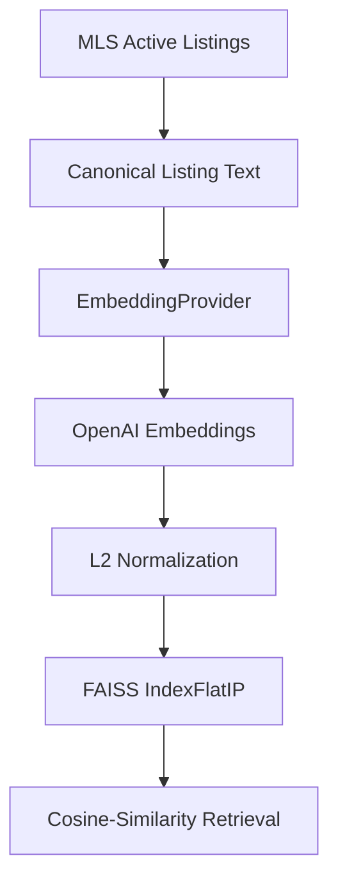
```mermaid
flowchart TD
    A[MLS Active Listings] --> B[Canonical Listing Text]
    B --> C[EmbeddingProvider]
    C --> D[OpenAI Embeddings]
    D --> E[L2 Normalization]
    E --> F[FAISS IndexFlatIP]
    F --> G[Cosine-Similarity Retrieval]
```

The embedding builder supports batched generation and checkpoint/resume
so full-corpus indexing can recover from interrupted API runs without
recomputing completed batches.

The current full-corpus index contains **52,794 active MLS listings with
52,794 distinct listing IDs**.

### Hybrid Property Search

Pure semantic retrieval captures qualitative preferences well but does
not guarantee hard MLS constraints such as city, budget, bedroom count,
or property type.

The hybrid retrieval path therefore separates eligibility from
preference ranking:

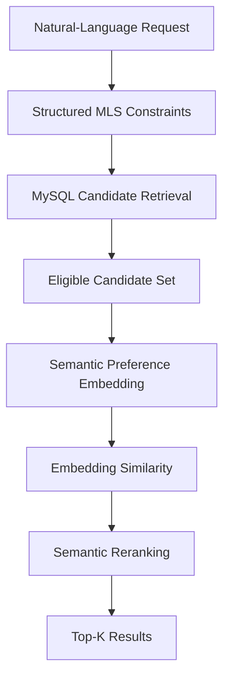
```mermaid
flowchart TD
    A[Natural-Language Request] --> B[Structured MLS Constraints]
    B --> C[MySQL Candidate Retrieval]
    C --> D[Eligible Candidate Set]
    D --> E[Semantic Preference Embedding]
    E --> F[Embedding Similarity]
    F --> G[Semantic Reranking]
    G --> H[Top-K Results]
```

Structured constraints determine which listings are eligible, while
semantic similarity determines which eligible listings best match softer
preferences such as modern design, natural light, open layouts, views,
or lifestyle characteristics.

### Retrieval Evaluation

A lightweight retrieval benchmark compares four retrieval strategies:

| Mode | Hard constraints | Soft semantic preferences |
| --- | --- | --- |
| Structured | Yes | Limited |
| Keyword | Yes | Exact lexical matching |
| Semantic | No | Strong |
| Hybrid | Yes | Strong |

Full-corpus evaluation showed the expected trade-off: pure semantic
retrieval captured qualitative intent but did not enforce structured MLS
constraints, while hybrid retrieval preserved hard-constraint compliance
and semantically reranked eligible candidates.

Across the three evaluation scenarios, hybrid retrieval maintained a
**100% hard-constraint pass rate** while achieving strong preference
coverage.

Raw evaluation output:

```text
artifacts/benchmarks/retrieval_comparison_full.csv
```

### Hybrid Similar-Home Recommendation

Hybrid search answers **which homes satisfy a user's requirements**. The
similar-home recommendation workflow answers a different question:
**which active listings are most similar to a home the user already
likes**.

Given a target listing, the system applies property-type compatibility
rules, computes property-attribute and semantic similarity across the
full active-listing embedding corpus, and returns the highest-ranked
compatible listings.

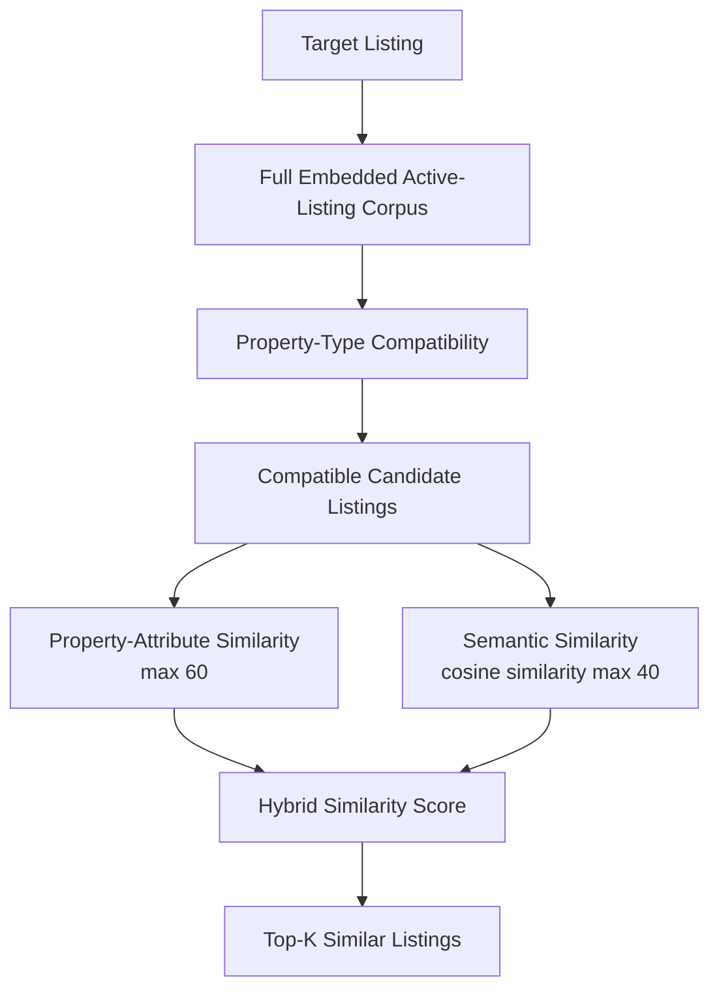
```mermaid
flowchart TD
    A[Target Listing] --> B[Full Embedded Active-Listing Corpus]
    B --> C[Property-Type Compatibility]
    C --> D[Compatible Candidate Listings]
    D --> E[Property-Attribute Similarity<br/>max 60]
    D --> F[Semantic Similarity<br/>cosine similarity max 40]
    E --> G[Hybrid Similarity Score]
    F --> G
    G --> H[Top-K Similar Listings]
```

The property-attribute component emphasizes measurable property
characteristics, while the semantic component captures softer
characteristics expressed in listing text, including architectural
style, renovation quality, natural light, open layouts, views, and
lifestyle features.

Property-type compatibility is enforced before final ranking so a
semantically similar but structurally incompatible listing does not
outrank an appropriate same-type property.

### Sold-Comparable Recommendation Validation

Similarity and market value are intentionally treated as separate
questions. After the Top-K similar active listings are selected, each
recommendation is independently validated against recent sold
comparables using the existing market-analysis components.

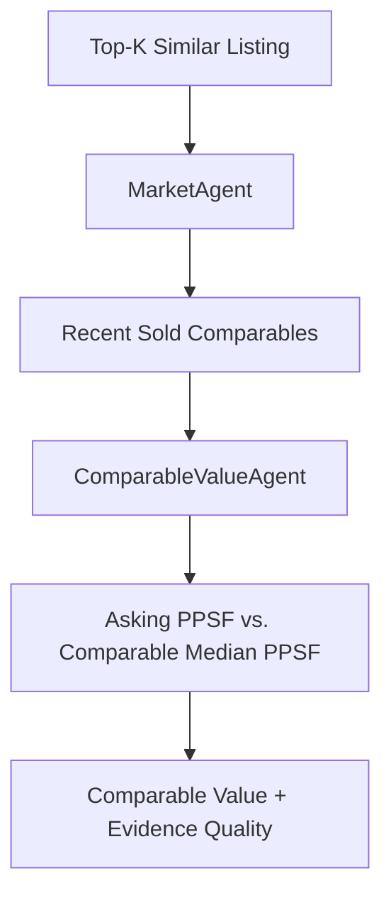
```mermaid
flowchart TD
    A[Top-K Similar Listing] --> B[MarketAgent]
    B --> C[Recent Sold Comparables]
    C --> D[ComparableValueAgent]
    D --> E[Asking PPSF vs. Comparable Median PPSF]
    E --> F[Comparable Value + Evidence Quality]
```

The validation layer reports two distinct signals:

| Signal | Meaning |
| --- | --- |
| Comparable Value | How the asking price compares with recent sold-comparable evidence |
| Evidence Quality | How strongly the available comparable set supports that value conclusion |

Comparable evidence quality reflects factors such as match strictness,
comparable count, and usable PPSF coverage. This keeps recommendation
similarity separate from pricing evidence and makes the final
recommendation easier to inspect.

## Document-Aware Knowledge RAG --- Week 8

Week 8 adds a separate knowledge-RAG path for questions about
real-estate terminology, California agency/disclosure concepts, and
project-specific MLS field mappings. It does not replace property
search: listing retrieval returns properties, while knowledge retrieval
returns explanatory document chunks.

### Knowledge Pipeline

The corpus currently uses the project-maintained `mls_field_mapping.md`,
real-estate terminology and law/reference documents, and the internship
handbook. Documents are chunked with source/section metadata, embedded
through the existing provider abstraction, L2-normalized, and indexed in
FAISS.

The knowledge corpus currently includes:

-   `docs/mls_field_mapping.md` --- project-maintained mappings between
    raw MLS fields and project-facing field names.
-   `docs/real_estate_terminology.md` --- curated real-estate
    terminology and concept references used for document retrieval.
-   `docs/real_estate_law.md` --- curated California agency/disclosure
    reference material used for knowledge retrieval.
-   `handbook.pdf` --- internship handbook content used as an additional
    project knowledge source.

These documents are used as project knowledge sources; the
project-maintained MLS mapping is not presented as official IDX MLS
documentation.

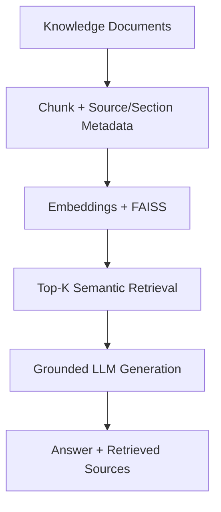
```mermaid
flowchart TD
    A[Knowledge Documents] --> B[Chunk + Source/Section Metadata]
    B --> C[Embeddings + FAISS]
    C --> D[Top-K Semantic Retrieval]
    D --> E[Grounded LLM Generation]
    E --> F[Answer + Retrieved Sources]
```

`mls_field_mapping.md` is project-maintained documentation and is not
presented as official IDX MLS documentation.

### Retrieval Evaluation

A **21-case** benchmark contains 18 answerable questions and 3
unsupported questions. Answerable cases cover terminology, California
agency/disclosure concepts, MLS field mappings, and cross-document
retrieval. The evaluator tracks Top-1 expected-source accuracy and Top-K
expected-source, section, and content hits, with simple failure
diagnostics.

A Top-K sensitivity check produced:

| Metric | Top-4 | Top-6 |
| --- | ---: | ---: |
| Top-1 source accuracy | 88.9% | 88.9% |
| Expected-source hit rate | 94.4% | **100.0%** |
| Expected-section hit rate | 83.3% | **88.9%** |
| Expected-content hit rate | 94.4% | 94.4% |

Top-6 is the current default because it recovered the missing mapping
document for the cross-document list-to-close case. The unchanged Top-1
metric shows that increasing K improved retrieval coverage rather than
ranking quality. Remaining misses are mainly Top-1 ambiguity,
section-label alignment, and one strict multi-term content expectation.

The three unsupported cases had Top-1 similarity scores of 0.4043,
0.4216, and 0.3409. Because this sample is too small to calibrate a
reliable cutoff, the implementation does **not** hard-code a similarity
threshold from these values.

Top-6 is also the default used by the current knowledge-retrieval code
and Streamlit Knowledge Assistant. The evaluator keeps `--top-k`
configurable so the sensitivity result is reproducible without changing
code:

```bash
# Current/default evaluation depth
python -m src.dev_evaluate_knowledge_retrieval --top-k 6

# Reproduce the Top-4 comparison
python -m src.dev_evaluate_knowledge_retrieval --top-k 4
```

Representative benchmark questions include:

-   `What does DOM mean in real estate?`
-   `Which field stores days on market in california_sold?`
-   `Which MLS field maps to bedroom count?`
-   `Which california_sold fields would you use to calculate a list-to-close price ratio?`
-   `Does California allow dual agency?`
-   unsupported/current-information checks such as
    `What is the current average mortgage rate in California?`

### Grounded Generation

`GroundedKnowledgeAnswerer` reuses the existing `BaseLLMProvider`
interface. It sends the retrieved Top-6 chunks to the LLM with
instructions to use only that context and to abstain when the context is
insufficient.

A five-question smoke test covered DOM terminology, a project MLS
bedroom mapping, a cross-document list-to-close field question,
California dual agency, and an unsupported current mortgage-rate
question. The four supported questions produced context-consistent
answers; the unsupported question returned the configured
insufficient-information fallback instead of a mortgage-rate estimate.

The reported source list represents **retrieved context**, not
sentence-level citation attribution. No reranker, RAGAS-style generation
benchmark, or calibrated confidence threshold is claimed in the current
implementation.

## Unified Multi-Agent Orchestration --- Week 9

Week 9 adds a unified coordination layer above the capabilities
developed in Weeks 3--8. The goal is not to duplicate those systems, but
to provide one entry point that can decide which capability is needed,
dispatch it through a thin adapter, and combine results when a request
contains more than one intent.

### Unified Router

The router classifies each request into one of five routes:

| Route | Responsibility |
| --- | --- |
| `search` | Natural-language property search and recommendation workflow |
| `market` | City-level sold-comparable market analysis |
| `recommend` | Similar-home recommendation for an explicit listing ID |
| `knowledge` | Document-aware Week 8 knowledge RAG |
| `mixed` | Multi-capability request; currently dispatches `search` + `market` in parallel and merges both results |

A single-capability request dispatches only the selected branch. For
example, `What does DOM mean in real estate?` routes to `knowledge`,
while `Find homes in Irvine under $1.5M` routes to `search`.

### LangGraph Fan-Out / Fan-In

Mixed search-and-market requests use real graph fan-out/fan-in rather
than calling the two capabilities sequentially inside one node:

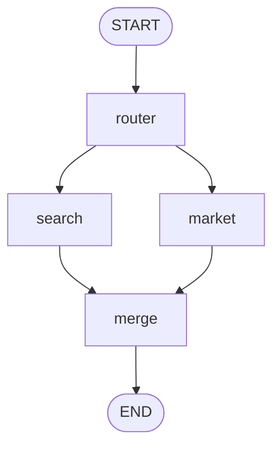
```mermaid
flowchart TD
    START([START]) --> ROUTER[router]
    ROUTER --> SEARCH[search]
    ROUTER --> MARKET[market]
    SEARCH --> MERGE[merge]
    MARKET --> MERGE
    MERGE --> END([END])
```

Parallel branches can both update orchestration metadata such as
`agents_invoked`. Reducer-aware state fields therefore combine
concurrent updates instead of treating them as conflicting writes. The
merge stage runs after the dispatched branches complete and produces one
unified response.

The mixed path also supports **partial failure**. If one branch fails
while another succeeds, the successful result is retained, the failure
is recorded in structured errors, and the final response can still
return useful output.

### Capability Adapters and Composition Root

The unified graph talks to four thin adapters instead of importing
UI-specific or capability-specific behavior into the orchestrator:

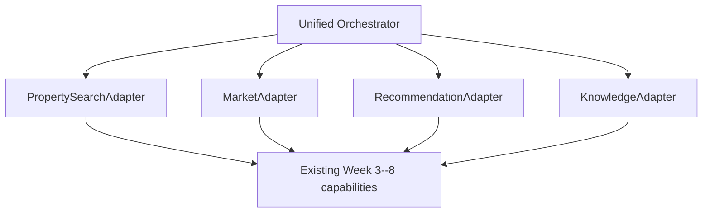
```mermaid
flowchart TD
    O[Unified Orchestrator]
    O --> S[PropertySearchAdapter]
    O --> M[MarketAdapter]
    O --> R[RecommendationAdapter]
    O --> K[KnowledgeAdapter]
    S --> C[Existing Week 3--8 capabilities]
    M --> C
    R --> C
    K --> C
```

This keeps the Week 3--8 implementations reusable and independently
testable. `create_orchestrator()` acts as the composition root: it
constructs the real search workflow, market agent, hybrid recommendation
service, and grounded knowledge answerer, then injects them into the
adapters and unified graph.

The response formatter consumes structured capability state rather than
stringifying raw internal objects. This keeps the final response concise
while preserving orchestration metadata such as selected route,
dispatched routes, invoked agents, route reason, errors, and session ID.

### FastAPI Service

Week 9 also exposes the orchestration layer through a lightweight
FastAPI service:

| Endpoint | Purpose |
| --- | --- |
| `GET /health` | Service health/environment check |
| `POST /search` | Property-search entry point |
| `POST /recommend` | Similar-home recommendation entry point |
| `POST /chat` | Unified router/orchestrator entry point |

The API and Streamlit UI are complementary interfaces over the same core
application composition. Streamlit remains the rich interactive demo,
while FastAPI provides a programmatic service boundary for future
frontend or backend integration.

A `/chat` response exposes a clean public orchestration contract
including the selected route, dispatched routes, route reason, invoked
agents, final response, structured errors, and session ID.

### Logging and Lightweight Memory

API orchestration completion is logged with operational metadata
including:

```text
route
agents_invoked
latency_ms
error_count
session_id
```

The project also defines a lightweight `MemoryStore` interface and an
in-process implementation. This provides a replaceable boundary for
session-scoped orchestration memory without claiming durable
cross-process or vector-based long-term memory. A persistent backend
such as Redis can be added later without changing the
orchestrator-facing interface.

### Week 9 Validation

The Week 9 test coverage includes:

-   single-route orchestration for search, market, recommendation, and
    knowledge;
-   mixed search + market fan-out/fan-in;
-   partial-failure preservation;
-   capability-adapter normalization and validation;
-   real composition-root construction helpers;
-   FastAPI health/search/recommend/chat contracts and request
    validation;
-   structured orchestration logging; and
-   `MemoryStore` behavior.

The focused Week 9 orchestration/API/memory suite completed with **38
passing tests**. Real integration smoke tests additionally exercised the
local composition root, knowledge artifacts, OpenAI-backed knowledge
path, and FastAPI `/chat` endpoint.

A representative API smoke request:

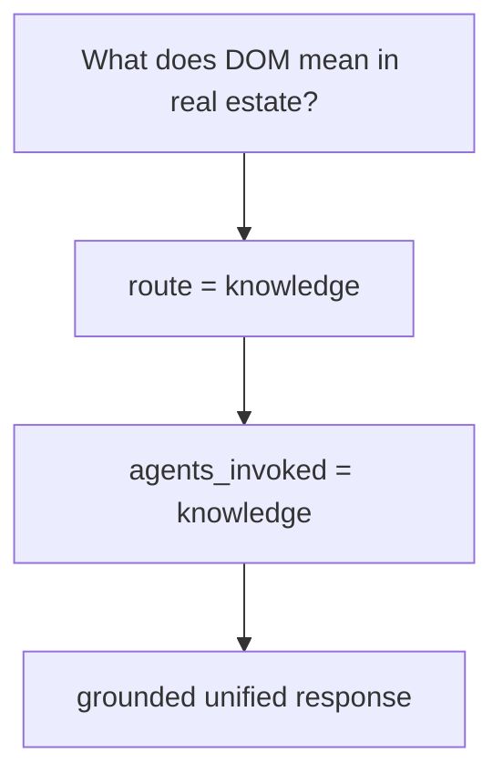
```mermaid
flowchart TD
    A[What does DOM mean in real estate?] --> B[route = knowledge]
    B --> C[agents_invoked = knowledge]
    C --> D[grounded unified response]
```

## Architecture

### Core Property-Search Workflow


```mermaid
flowchart TD
    U[User Query] --> QC[Query Compliance]

    QC -->|Red / blocked| REFUSAL[Return Refusal]
    REFUSAL --> END1([End])

    QC -->|Green or Yellow| INTENT[Intent Parsing + Session Memory]
    INTENT --> SEARCH[Structured MySQL Search]
    SEARCH --> CANDIDATES[Up to 50 Candidates]

    CANDIDATES --> PARALLEL[Bounded Candidate-Level Analysis<br/>ThreadPoolExecutor<br/>max_workers = 4]
    PARALLEL --> SUBGRAPH[Property Analysis Subgraph<br/>one invocation per listing]
    SUBGRAPH --> ERRORS[Isolate Candidate Errors]
    ERRORS --> RANK[Deterministic Top-K Ranking]

    RANK --> TOP5[Top 5 Recommendations]
    TOP5 --> EXPLAIN[Explanation Agent]
    EXPLAIN --> OC[Output Compliance]

    OC -->|Green| RESPONSE[Return Explanation]
    OC -->|Yellow| REWRITE[Return Safe Rewrite]
    OC -->|Red| BLOCK[Block Generated Output]

    RESPONSE --> END2([End])
    REWRITE --> END2
    BLOCK --> END2
```

### Property Analysis Subgraph

Each listing is analyzed through a reusable LangGraph subgraph:

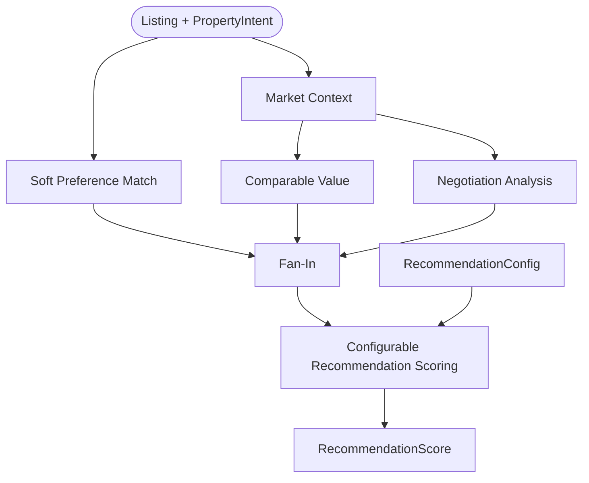
```mermaid
flowchart TD
    START([Listing + PropertyIntent])

    START --> MARKET[Market Context]
    START --> PREF[Soft Preference Match]

    MARKET --> VALUE[Comparable Value]
    MARKET --> NEG[Negotiation Analysis]

    PREF --> FANIN[Fan-In]
    VALUE --> FANIN
    NEG --> FANIN

    FANIN --> SCORE[Configurable Recommendation Scoring]
    CONFIG[RecommendationConfig] --> SCORE
    SCORE --> OUTPUT[RecommendationScore]
```

The system therefore uses two levels of parallelism:

1.  Up to four listing-level subgraphs run concurrently.
2.  Inside each subgraph, Market Context and Preference Match run
    independently, followed by parallel Comparable Value and Negotiation
    analysis.

For detailed workflow boundaries, concurrency design, failure handling,
state contracts, and limitations, see
[`docs/architecture.md`](docs/architecture.md).

### Retrieval and Similar-Home Recommendation Extension

Week 7 adds retrieval and similar-home recommendation capabilities
alongside the existing LangGraph property-search workflow rather than
replacing the reusable property-analysis subgraph.

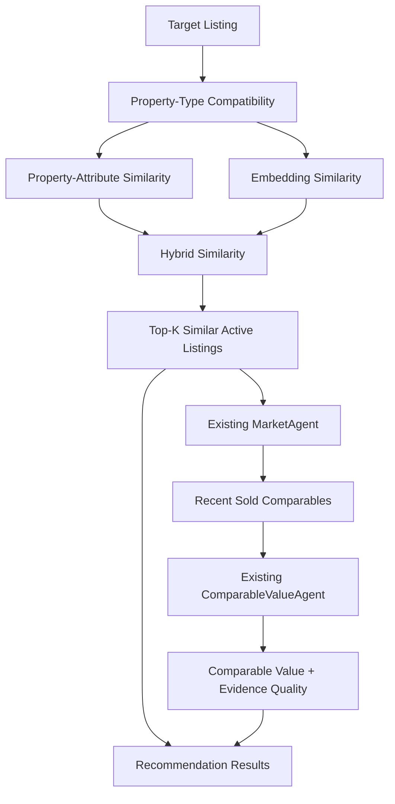
```mermaid
flowchart TD
    TARGET[Target Listing] --> GUARD[Property-Type Compatibility]
    GUARD --> STRUCT[Property-Attribute Similarity]
    GUARD --> SEM[Embedding Similarity]

    STRUCT --> HYBRID[Hybrid Similarity]
    SEM --> HYBRID

    HYBRID --> TOPK[Top-K Similar Active Listings]

    TOPK --> MARKET[Existing MarketAgent]
    MARKET --> COMPS[Recent Sold Comparables]
    COMPS --> VALUE[Existing ComparableValueAgent]

    VALUE --> VALIDATION[Comparable Value + Evidence Quality]
    TOPK --> OUTPUT[Recommendation Results]
    VALIDATION --> OUTPUT
```

This extension reuses the existing market and comparable-value logic,
avoiding a second overlapping market-analysis path.

### Week 9 Unified Orchestrator

The Week 9 layer coordinates existing capabilities without replacing
their internal workflows:

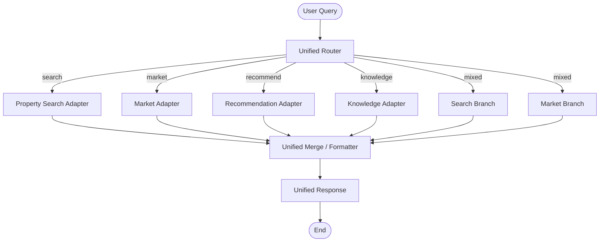
```mermaid
flowchart TD
    START([User Query]) --> ROUTER[Unified Router]

    ROUTER -->|search| SEARCH[Property Search Adapter]
    ROUTER -->|market| MARKET[Market Adapter]
    ROUTER -->|recommend| REC[Recommendation Adapter]
    ROUTER -->|knowledge| KNOW[Knowledge Adapter]

    ROUTER -->|mixed| MSEARCH[Search Branch]
    ROUTER -->|mixed| MMARKET[Market Branch]

    SEARCH --> MERGE[Unified Merge / Formatter]
    MARKET --> MERGE
    REC --> MERGE
    KNOW --> MERGE
    MSEARCH --> MERGE
    MMARKET --> MERGE

    MERGE --> RESPONSE[Unified Response]
    RESPONSE --> END([End])
```

For mixed requests, search and market are dispatched as independent
graph branches. Reducer-safe orchestration state accumulates parallel
metadata and the merge node combines available branch results after
fan-in.

## Parallel Execution and Failure Isolation

The parent workflow supports both execution modes:

```text
Sequential mode
Candidate 1 → Candidate 2 → ... → Candidate 50

Parallel mode
Up to 4 candidate subgraphs execute concurrently
```

A candidate failure is recorded as:

```text
{
    listing_key: ...,
    error: ...
}
```

Successful candidates continue to final ranking. A single malformed
listing or repository error therefore does not automatically discard the
entire batch.

## Performance Validation

The performance harness:

-   parses and searches once;
-   reuses the same 50 candidate objects in both modes;
-   performs an unmeasured warm-up;
-   runs three alternating sequential/parallel pairs;
-   records successful and failed candidate counts;
-   verifies Top-5 output consistency after every pair;
-   reports median latency rather than a single run.

Measured runs:

```text
Sequential: 52.13 s, 50.60 s, 50.59 s
Parallel:   23.12 s, 22.92 s, 22.36 s
```

Result:

```text
50.60 s → 22.92 s
54.7% lower median candidate-analysis latency
2.21× speedup
0 candidate errors
Identical sequential/parallel recommendation outputs
```

The measured improvement reflects the combined effect of bounded
candidate-level concurrency and parallel branches within the
listing-level subgraph. The benchmark does not attempt to attribute the
speedup to each layer independently.

## Interactive Streamlit Application

The Streamlit application now exposes four complementary tabs:
**Property Search**, **Similar Home Recommendation**, **Knowledge
Assistant**, and **Unified Copilot**.

### Property Search

-   Natural-language MLS search with hard constraints and soft
    preferences
-   Multi-turn session memory and search history
-   Fair Housing query/output safeguards
-   MySQL-backed candidate retrieval
-   Bounded parallel property analysis
-   Market-aware scoring and explainable Top-5 recommendations

### Similar Home Recommendation

-   Target-listing lookup by MLS listing ID
-   Property-attribute + semantic hybrid similarity
-   Full-corpus embedding coverage
-   Top-K similar active listings
-   Sold-comparable validation and PPSF-based evidence
-   Expandable similarity and market-evidence breakdowns

### Knowledge Assistant

The Week 8 demo exposes the document-aware RAG path directly in
Streamlit. Users can enter a project-knowledge question, choose the
number of retrieved chunks, inspect the grounded answer, and expand the
retrieved evidence with source, section, chunk ID, and similarity score.
The sidebar also keeps a separate **Knowledge RAG History**.

The current code/demo defaults to **Top-6** retrieved chunks, matching
the retrieval sensitivity result. The UI control remains adjustable for
interactive inspection; quantitative Top-4/Top-6 comparisons should be
reproduced with the CLI evaluator rather than inferred from one demo
query.

Recommended demo questions:

-   **Terminology:** `What does DOM mean in real estate?`
-   **Project field mapping:**
    `Which field stores days on market in california_sold?`
-   **Project field mapping:** `Which MLS field maps to bedroom count?`
-   **Cross-document:**
    `Which california_sold fields would you use to calculate a list-to-close price ratio?`
-   **California agency:** `Does California allow dual agency?`
-   **Handbook:** `What does the handbook say about RAG?`
-   **Unsupported/fallback check:**
    `What is the current average mortgage rate in California?`

The first five categories overlap with the retrieval/generation
evaluation and are useful for demonstrating terminology retrieval,
project-specific mappings, cross-document evidence, legal/reference
retrieval, and abstention behavior. The handbook question is useful as
an interactive corpus demo.

### Unified Copilot

The Week 9 tab provides a single natural-language entry point across the
existing capabilities. It displays the selected route, number of invoked
agents, dispatched capabilities, routing reason, unified response, and
any partial-failure details.

Representative demo requests:

-   **Search:** `Find homes in Irvine under $1.5M.`
-   **Knowledge:** `What does DOM mean in real estate?`
-   **Mixed:**
    `Find homes in Irvine and tell me about the local market.`

The mixed example demonstrates the Week 9 fan-out/fan-in path by
dispatching search and market independently and merging their completed
results.

The four UI paths intentionally remain complementary:

-   property search answers **what satisfies the user's requirements**;
-   similar-home recommendation answers **what resembles a selected
    property**;
-   the Knowledge Assistant answers **what the project knowledge
    documents support**; and
-   the Unified Copilot answers **which capability or capabilities
    should handle the request and how their results should be
    combined**.

The workflow object is stored in the Streamlit session so conversational
property-search criteria persist across turns. Knowledge questions
maintain their own RAG history, while the Unified Copilot keeps a
separate **Unified Copilot History** with route and invoked-agent
metadata in the sidebar.

## Technology Stack

Python 3.10, LangGraph, LangChain, OpenAI embeddings/LLM providers,
FAISS, NumPy, Pydantic, MySQL, FastAPI, Uvicorn, Streamlit, Pytest, and
`ThreadPoolExecutor`.

## Local Setup

```bash
python -m venv .venv
# Windows: .venv\Scripts\activate
pip install -r requirements.txt
python -m streamlit run src/app/streamlit_app.py

# Optional Week 9 API service
uvicorn src.api.app:app --reload
```

Create `.env` from `.env.example` and configure local MySQL and
model-provider credentials. Secrets and internal MLS data must not be
committed.

## Testing and Validation

```bash
pytest -v
python -m src.dev_evaluate_retrieval
python -m src.dev_evaluate_knowledge_retrieval              # default Top-6
python -m src.dev_evaluate_knowledge_retrieval --top-k 6      # explicit current setting
python -m src.dev_evaluate_knowledge_retrieval --top-k 4      # sensitivity comparison
python -m src.dev_test_grounded_knowledge
python -m src.dev_benchmark_candidate_parallel

# Week 9 focused validation
python -m pytest tests/test_orchestration_capabilities.py tests/test_orchestrator.py tests/test_orchestration_adapters.py tests/test_orchestration_composition.py tests/test_api.py tests/test_memory_store.py -v
```

The full repository test suite currently completes with **215 passing
tests**. This includes the original property-search, compliance, memory,
market, recommendation, retrieval, and Week 8 knowledge coverage plus
the Week 9 router, orchestrator, adapters, composition, FastAPI,
logging, and `MemoryStore` tests.

Validation now covers workflow routing, compliance, session memory,
repository/query behavior, market and recommendation scoring,
sequential/parallel consistency, semantic/hybrid listing retrieval,
similar-home scoring, knowledge retrieval evaluation, grounded
generation, unified single/mixed routing, partial failures, API
contracts, operational logging, and the lightweight memory-store
interface.

## Repository Structure

```text
src/
├── agents/          # Workflow and market-analysis agents
├── api/             # FastAPI application and public request/response schemas
├── app/             # Streamlit application
├── embeddings/      # Listing embedding utilities
├── evaluation/      # Retrieval evaluation cases and metrics
├── knowledge/       # Grounded knowledge answering
├── memory/          # Search memory + pluggable orchestration MemoryStore
├── orchestration/   # Week 9 router, adapters, composition, unified graph
├── providers/       # LLM and embedding provider abstractions
├── recommendation/  # Ranking, similarity, scoring, explanation
├── search/          # Structured, semantic, hybrid, knowledge retrieval
└── workflow/        # Parent graph and property-analysis subgraph

docs/
├── architecture.md
├── mls_field_mapping.md
├── real_estate_terminology.md
└── real_estate_law.md

artifacts/
├── benchmarks/
├── embeddings/
└── knowledge/
```

Internal MLS datasets are excluded; public demos should use synthetic
data.

## Project Status

Week 6 established the tested LangGraph MVP with bounded parallel
property analysis and a measured **2.21×** candidate-analysis speedup
(**54.7%** lower median latency). Week 7 added the **52,794-listing**
embedding index, semantic and hybrid retrieval, similar-home
recommendation, sold-comp validation, and the expanded Streamlit
workflow.

Week 8 adds document-aware knowledge RAG and exposes it through a third
Streamlit **Knowledge Assistant** tab with adjustable retrieval depth,
grounded answers, expandable evidence, and separate RAG history. On the
current 18 answerable-case benchmark, Top-6 retrieval reached **100.0%
expected-source hit rate**; a five-question grounded-generation smoke
test also demonstrated unsupported-query abstention. These are
project-benchmark results, not claims of general production accuracy.

Week 9 adds the **Unified Agentic Copilot** above the existing Week 3--8
capabilities. It supports search, market, recommendation, and knowledge
single-route requests plus a real search + market mixed fan-out/fan-in
path. The orchestration layer includes thin capability adapters,
reducer-safe parallel state, merge-time response formatting,
partial-failure preservation, a shared composition root, FastAPI service
endpoints, structured latency/error logging, a lightweight pluggable
`MemoryStore`, and a fourth Streamlit **Unified Copilot** tab with
separate history. The focused Week 9 orchestration/API/memory regression
run completed with **38 passing tests**, while the final full repository
suite completed with **215 passing tests**. Real smoke tests
successfully exercised both the composition root and FastAPI `/chat`
knowledge route.