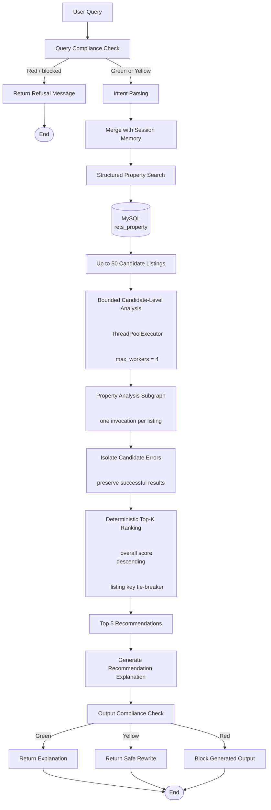

# System Architecture

## 1. Overview

This project implements a LangGraph-based real-estate search and
recommendation workflow that combines:

- natural-language property intent parsing;
- multi-turn session memory;
- structured MySQL property retrieval;
- Fair Housing query and output guardrails;
- sold-comparable market analysis;
- soft-preference matching;
- comparable-value and negotiation scoring;
- bounded parallel property analysis;
- configurable recommendation aggregation;
- deterministic Top-K ranking.

The system is designed as a decision-support workflow rather than a
fully autonomous real-estate advisory system.

The current implementation retrieves up to 50 active-property
candidates, analyzes them through reusable listing-level subgraphs, and
returns the five highest-ranked recommendations.

---

## 2. Architectural Goals

The current architecture is designed around six primary goals.

### 2.1 Separation of responsibilities

Each component has a narrow responsibility:

- `IntentAgent` parses structured property intent.
- `SessionMemory` preserves preferences across turns.
- `ComplianceAgent` screens incoming queries and generated output.
- `SearchAgent` retrieves active listing candidates.
- `MarketAgent` retrieves and summarizes sold-comparable evidence.
- `PreferenceMatchAgent` evaluates soft preferences.
- `ComparableValueAgent` estimates value relative to sold comparables.
- `NegotiationAgent` estimates negotiation leverage.
- `RecommendationAgent` combines analysis signals and ranks results.
- `ExplanationAgent` converts structured recommendations into user-facing
  text.

### 2.2 Typed workflow state

The parent workflow uses `AgentState`, while each listing-level analysis
uses a dedicated `PropertyAnalysisState`.

Typed state contracts make the graph easier to test, inspect, and extend.

### 2.3 Reusable property-analysis unit

All analysis for one listing is encapsulated in
`PropertyAnalysisSubgraph`.

The parent graph does not implement comparable-value, negotiation, or
preference logic directly. It only invokes the subgraph, collects
structured recommendations, and performs final ranking.

### 2.4 Bounded concurrency

Candidate analysis is I/O-heavy because market analysis performs MySQL
queries against sold-property data.

The parent workflow therefore uses bounded thread-based concurrency
rather than creating one unbounded worker per candidate.

### 2.5 Deterministic recommendation behavior

Parallel execution can return candidates in completion order rather than
search order.

The ranking layer removes this nondeterminism by sorting primarily by
overall recommendation score and secondarily by listing key.

### 2.6 Policy configuration

Recommendation weights and label thresholds are represented as a typed,
immutable, validated configuration object instead of hard-coded constants
inside the scoring method.

---

## 3. End-to-End Workflow



### 3.1  Query compliance

Every query enters the compliance node before intent parsing or database
access.

A red-risk query is blocked immediately and routed to the end of the
graph. Search, recommendation, and explanation nodes are never invoked
for blocked requests.

Green and yellow requests continue through the workflow. Yellow requests
are permitted to continue using neutral, objective criteria, with a
notice added to the final response when appropriate.

### 3.2 Intent parsing and memory

IntentAgent produces a structured PropertyIntent containing:

- city;
- maximum price;
- minimum bedrooms;
- minimum bathrooms;
- normalized property type;
- hard keywords;
- soft preferences.

When session memory is enabled, incomplete follow-up queries inherit
previously remembered values.

For example:

```text
Turn 1:
Find townhouses in Irvine

Turn 2:
Under 1.2 million

Turn 3:
At least 3 bedrooms with a garage
```

The final intent retains the city, property type, maximum price,
bedroom requirement, and garage keyword.

### 3.3 Candidate retrieval

SearchAgent delegates retrieval to a repository implementation.

The current production-style development path uses
MySQLSearchRepository, which:

- builds parameterized SQL through PropertyQueryBuilder;
- opens a MySQL connection;
- executes the query with bound parameters;
- converts database rows into ListingSchema;
- closes the cursor and connection.

The parent graph retrieves up to 50 listings for downstream reranking.

The search layer deliberately returns a larger candidate pool than the
final result count so that recommendation agents can perform meaningful
reranking.

### 3.4 Candidate analysis

Each candidate listing is submitted to the same reusable
PropertyAnalysisSubgraph.

The default execution mode uses:

```text
max_parallel_candidates = 4
```

The executor therefore processes up to four listing-level subgraphs at
the same time.

### 3.5 Ranking and explanation

Successful listing analyses produce RecommendationScore objects.

The parent graph ranks these objects and retains the top five.

The ExplanationAgent receives ranked structured recommendations rather
than raw listing rows, allowing it to explain both the final score and
the supporting signals.

### 3.6 Output compliance

Generated explanation text is screened before being returned.

- Green output is returned directly.
- Yellow output is replaced with a neutral rewrite.
- Red output is blocked.
- A yellow input query may also add a neutral-criteria notice even when
the generated output itself is green. 

---

## 4. Property Analysis Subgraph

Each subgraph invocation analyzes exactly one active listing.

```text
Listing + Intent
        │
        ├── Market Context ──┬── Comparable Value ──┐
        │                    └── Negotiation ────────┤
        └── Preference Match ────────────────────────┤
                                                     ↓
                                      Recommendation Scoring
                                                     ↓
                                      RecommendationScore
```

## 4.1 Stage 1: independent analysis

The subgraph starts two independent nodes:

```text
Market Context Analysis
Soft Preference Match
```

Preference matching only requires the listing and parsed intent.

Market analysis requires the listing and sold-comparable repository.

Running these nodes concurrently avoids forcing a lightweight preference
calculation to wait for database I/O.

## 4.2 Stage 2: market-dependent analysis

After market context is available, two additional nodes execute in
parallel:

```text
Comparable Value Analysis
Negotiation Analysis
```

Both depend on the same market context, but neither depends on the other.

## 4.3 Fan-in and scoring

Recommendation scoring waits until all three analysis signals exist:

- preference analysis;
- comparable-value analysis;
- negotiation analysis.

The scorer then produces one structured RecommendationScore.

## 4.4 Parent/subgraph responsibility boundary

The listing-level subgraph is responsible for:

- market analysis;
- preference matching;
- comparable-value analysis;
- negotiation analysis;
- recommendation scoring.

The parent workflow is responsible for:

- query routing;
- session memory;
- active-property search;
- invoking multiple listing subgraphs;
- failure isolation;
- Top-K ranking;
- explanation;
- output compliance.

This boundary prevents the listing subgraph from becoming responsible
for collection-level behavior. 

---

## 5. Hierarchical Parallel Execution

The system contains two levels of parallelism.

### 5.1 Candidate-level parallelism

The parent graph analyzes up to four candidates concurrently using
ThreadPoolExecutor.

For 50 candidates, execution occurs in approximately 13 bounded groups,
subject to individual task duration and worker availability.

Conceptually:

```text
Worker 1 → Candidate 1 → Candidate 5 → Candidate 9 ...
Worker 2 → Candidate 2 → Candidate 6 → Candidate 10 ...
Worker 3 → Candidate 3 → Candidate 7 → Candidate 11 ...
Worker 4 → Candidate 4 → Candidate 8 → Candidate 12 ...
```

The executor does not create 50 simultaneous MySQL workloads.

### 5.2 Subgraph-level parallelism

Within each candidate:

```text
Market Context || Preference Match

then

Comparable Value || Negotiation
```

The final scoring node executes only after the required fan-in.

### 5.3 Why bounded concurrency

Unbounded candidate execution could:

- exhaust MySQL connections;
- increase disk and database contention;
- create unstable latency;
- consume unnecessary memory;
- make local development behavior unpredictable.

Four workers provide a controlled balance between concurrency and
database pressure.

### 5.4 Why threads

Candidate analysis is dominated by database I/O rather than pure Python
CPU work.

Threads allow another candidate task to make progress while one worker
waits for MySQL.

---

## 6. Data Access Layer

The workflow separates active-listing retrieval from sold-comparable
retrieval.

### 6.1 Active-property repository

MySQLSearchRepository queries the active listing table through
parameterized SQL.

Responsibilities:

- load database configuration from environment variables;
- delegate SQL construction to PropertyQueryBuilder;
- execute parameterized statements;
- format rows into ListingSchema;
- close database resources after each request. 

### 6.2 Sold-comparable repository

MySQLSoldCompRepository queries california_sold.

It supports:

- recent city-level sold comparables;
- optional postal-code filtering;
- four-level comparable fallback;
- date-window filtering;
- property-type matching;
- bedroom and bathroom tolerance;
- square-footage tolerance.

The fallback sequence is:

```text
strict
→ relaxed
→ broad
→ market_fallback
```

This allows the analysis pipeline to preserve comparable coverage when
strict matching produces too few records.

### 6.3 Connection lifecycle

Each repository query opens and closes its own MySQL connection and
cursor.

The repository does not store a long-lived shared connection on the
agent instance.

This design reduces shared-connection conflicts during candidate-level
threaded execution, although it introduces repeated connection-creation
overhead.

---

## 7. Recommendation Scoring Policy

RecommendationAgent combines three normalized component scores:

```text
Overall Score =
    Preference Match × 0.40
  + Comparable Value × 0.35
  + Negotiation × 0.25
```

The default policy emphasizes user preference alignment while retaining
substantial comparable-value and negotiation evidence.

### 7.1 Configurable weights

The default weights are stored in RecommendationConfig:

| Component | Default Weight |
|-----------|---------------:|
| Preference Match | 0.40 |
| Comparable Value | 0.35 |
| Negotiation | 0.25 |

The configuration validates that:

- no weight is negative;
- all weights sum to 1.0.

### 7.2 Configurable labels

The default score labels are:

| Score | Label |
|-------|-------|
| 80–100 | Strong Match |
| 65–79.99 | Good Match |
| 50–64.99 | Moderate Match |
| <50 | Limited Match |

Threshold validation requires:

```text
0 <= moderate < good < strong <= 100
```

## 7.3 Immutable configuration

RecommendationConfig is a frozen dataclass.

After initialization, workflow threads read the same immutable scoring
policy without modifying it during candidate analysis.

## 7.4 Reason aggregation

The final recommendation reasons preserve the following order:

- preference signals;
- comparable-value signals;
- negotiation signals.

This produces predictable explanation ordering and supports regression
testing.

---

## 8. Deterministic Ranking

Candidate-level parallelism returns completed tasks in completion order.

Completion order is not a stable ranking signal.

The ranking layer therefore sorts by:

```text
1. overall score descending;
2. listing key ascending.
```

The listing key is used only as a deterministic tie-breaker.

This guarantees that two equal-scoring listings produce the same final
ordering regardless of which thread finishes first.

--- 

## 9. Workflow State

### 9.1 Parent state

AgentState includes:

- user_query;
- parsed intent;
- memory_snapshot;
- query and output compliance reports;
- search results;
- ranked recommendations;
- candidate analysis errors;
- explanation text;
- final response;
- blocked status;
- workflow error.

### 9.2 Property-analysis state

PropertyAnalysisState includes:

- one listing;
- one parsed intent;
- market context;
- preference analysis;
- comparable-value analysis;
- negotiation analysis;
- recommendation;
- error.

Using a separate state type makes the listing-level graph reusable and
prevents collection-level concerns from leaking into it.

---

## 10. Failure Handling

### 10.1 Workflow-level failures

The parent run() method catches unhandled workflow exceptions and
returns:

```text
The property search could not be completed.
```

The original error string is stored in workflow state.

### 10.2 Candidate-level failures

Each candidate future is handled independently.

When one candidate fails, the workflow records:

```text
listing_key
error
```

in candidate_analysis_errors.

Other candidate results continue to ranking.

This prevents a single malformed listing or database error from
discarding the entire recommendation batch.

### 10.3 Missing recommendation protection

If a listing-level subgraph completes without returning a recommendation,
the parent raises a candidate-specific error rather than silently
dropping the result.

---

## 11. Compliance Boundaries

Compliance is enforced at both external boundaries of the workflow.

### 11.1 Input boundary

The query compliance node executes before:

- intent parsing;
- memory mutation;
- database search;
- recommendation analysis.

This prevents blocked requests from affecting memory or reaching
downstream systems.

### 11.2 Output boundary

The generated explanation is screened before being returned.

This provides a second safeguard against demographic steering or unsafe
language introduced during explanation generation.

### 11.3 Scope

The current guardrail is rule-based and versioned.

It is an engineering safeguard and is not presented as exhaustive legal
coverage or a substitute for legal review.

---

## 12. Session Memory

Session memory supports progressive query refinement.

The IntentAgent first parses only values explicitly present in the
current turn.

When memory is enabled, the current values are merged with remembered
values to produce the effective intent.

The current turn is then stored without persisting None or empty
collections.

Memory can be cleared explicitly through the parent graph.

Blocked queries do not update memory.

---

## 13. Performance Benchmark

Candidate-level parallel execution was compared with the retained
sequential baseline using the same parsed intent and the same 50
candidate listing objects.

### 13.1 Benchmark configuration
```text
Candidates: 50
Parallel workers: 4
Measured runs per mode: 3
Execution order: alternating sequential and parallel
Output consistency: checked after each pair
Candidate errors: required to remain zero
```

### 13.2 Results
| Metric | Sequential | Parallel |
|--------|-----------:|---------:|
| Median candidate-analysis latency | 50.60 s | 22.92 s |
| Successful candidates | 50 | 50 |
| Candidate errors | 0 | 0 |
| Top-5 output consistency | PASS | PASS |


Derived improvement:

**Derived Improvement**

- **Speedup:** **2.21×**
- **Latency reduction:** **54.7%**


The benchmark measures candidate property analysis, not the entire
Streamlit request lifecycle.

Intent parsing, initial active-property search, final explanation,
compliance screening, and UI rendering are outside this timing window.

### 13.3 Interpretation

The measured result represents the combined effect of:

- bounded candidate-level concurrency;
- parallel branches inside each listing-level LangGraph subgraph.

The current benchmark does not isolate the independent contribution of
each parallelism layer.

---

## 14. Validation Strategy

The project uses separate validation layers.

### 14.1 Unit and regression tests

Tests cover:

- intent parsing;
- session memory;
- compliance rules;
- query construction;
- property formatting;
- CSV and MySQL repository behavior;
- comparable-value analysis;
- negotiation analysis;
- preference matching;
- recommendation configuration;
- recommendation scoring and ranking;
- property-analysis subgraph behavior;
- parent LangGraph routing.

### 14.2 Parallel regression validation

Sequential and parallel modes are compared using the same candidates.

Validation includes:

- identical candidate coverage;
- identical component scores;
- identical labels;
- identical reasons;
- identical final Top-K ranking.

### 14.3 Integration smoke testing

A real MySQL-backed workflow smoke test confirms:

- 50 candidates are retrieved;
- four-worker parallel mode is active;
- five recommendations are returned;
- no candidate analysis errors occur. 

### 14.4 Performance benchmark

The latency harness performs multiple measured runs, uses median latency,
alternates execution order, checks candidate success counts, and verifies
output consistency after each sequential/parallel pair.

---

## 15. Current Limitations

### 15.1 Rule-based intent parsing

Intent extraction currently uses deterministic phrase and regular
expression matching.

Supported cities, property types, and keywords are explicitly enumerated.

The current parser does not provide general open-domain language
understanding.

### 15.2 No labeled recommendation ground truth

The project does not yet have:

- user click data;
- saved-property data;
- transaction outcomes;
- expert-labeled relevance judgments.

Therefore the project does not claim recommendation Precision@K, NDCG,
or learned-ranking accuracy.

### 15.3 Local MySQL dependency

The complete workflow depends on local active-listing and sold-property
tables.

A public deployment requires a synthetic-data or cloud-data mode that
does not expose restricted data.

### 15.4 Repeated connection creation

Each repository query creates a new MySQL connection.

This simplifies thread safety but may add connection overhead.

A future production deployment could introduce a bounded connection
pool.

### 15.5 No per-candidate timeout or retry policy

Candidate failures are isolated, but the current implementation does not
yet define:

- per-candidate timeouts;
- retry limits;
- circuit breakers;
- backpressure based on database health.

### 15.6 Rule-based recommendation policy

The recommendation score is deterministic and configurable but remains
manually weighted.

The weights have not yet been calibrated against labeled user relevance
data. 

---

## 16. Planned Extensions

The planned extensions preserve the current repository interfaces and 
typed workflow contracts whenever possible, allowing incremental upgrades 
without requiring major architectural changes. 

### 16.1 Semantic retrieval

A future retrieval layer may add embedding-based search over listing
remarks. 

The intended design is hybrid:

```text
Structured SQL filters
+
Semantic Top-K retrieval
+
Property analysis and reranking
```

Semantic retrieval should supplement structured constraints rather than
replace them.

### 16.2 Retrieval evaluation

Once semantic retrieval is added, evaluation can compare:

- keyword-only retrieval;
- semantic retrieval;
- hybrid retrieval;
- retrieval latency;
- human-judged Top-K relevance. 

### 16.3 External configuration profiles

The typed recommendation configuration can later be loaded from:

- YAML;
- JSON;
- environment-specific profiles;
- experiment configurations.

Examples may include:

- preference-focused;
- value-focused;
- negotiation-focused;
- balanced profiles. 

### 16.4 Connection pooling

A bounded MySQL connection pool could reduce repeated connection setup
cost while preserving controlled concurrency.

### 16.5 Public synthetic demo

A public Streamlit version can use synthetic listing and sold-comparable
data while retaining the same repository interfaces and workflow
architecture.

### 16.6 Data-driven Ranking

The current deterministic scoring contract provides a future migration
path to a learned ranking model.

The existing component scores could become model features while
preserving the same downstream RecommendationScore interface. 

Once user interaction logs or expert-labeled relevance data become available, 
the current deterministic recommendation policy can be replaced or augmented 
by a learned ranking model while preserving the existing 
RecommendationScore interface. 

### 16.7 Runtime and Communication

Future iterations may wrap the current LangGraph workflow with an 
OpenClaw-style runtime layer supporting skill registration,
human approval, and outbound communication channels while preserving 
the existing workflow architecture.

---

## 17. Design Summary

The architecture separates the system into three primary levels:

```text
Parent LangGraph
    query routing, memory, search, parallel orchestration,
    ranking, explanation, compliance

Property Analysis Subgraph
    listing-level market, preference, value, negotiation,
    and recommendation analysis

Repositories and Typed Contracts
    MySQL access, formatting, state schemas, and validated
    recommendation configuration
```

The current MVP demonstrates:

- graph-based multi-agent orchestration;
- reusable listing-level subgraphs;
- hierarchical parallel analysis;
- deterministic ranking;
- typed state and configuration;
- input and output compliance boundaries;
- MySQL-backed retrieval;
- candidate-level failure isolation;
- quantitative latency benchmarking;
- regression-verified output consistency.